# 🏢 Sistema EMPRESA Y - Gestão Empresarial

> Sistema de gestão empresarial desenvolvido como projeto freelancer para empresa do setor de vendas e relacionamento com clientes.

## 📋 Sobre o Projeto

O **Sistema EMPRESA Y** é uma aplicação web completa para gestão empresarial, desenvolvida sob medida para atender às necessidades específicas de uma empresa no setor de vendas. O sistema oferece funcionalidades robustas para controle de clientes, pedidos, fornecedores e relatórios gerenciais.

### 🎯 **Objetivos do Sistema**
- Centralizar informações de clientes e fornecedores
- Automatizar o processo de criação e gestão de pedidos
- Fornecer relatórios detalhados para tomada de decisões
- Oferecer interface responsiva para acesso em qualquer dispositivo
- Garantir segurança e integridade dos dados empresariais

## 🚀 Funcionalidades Principais

### 👥 **Gestão de Clientes**
- ✅ Cadastro completo com validação de CPF/CNPJ
- ✅ Máscaras automáticas para documentos e telefones
- ✅ Integração com API de CEP para endereços
- ✅ Histórico completo de relacionamento
- ✅ Sistema de busca avançada

### 📋 **Gestão de Pedidos**
- ✅ Criação de pedidos com múltiplos itens
- ✅ Cálculo automático de totais e impostos
- ✅ Vinculação automática com clientes
- ✅ Status de acompanhamento em tempo real
- ✅ Edição e remoção de itens dinamicamente

### 🏭 **Gestão de Fornecedores**
- ✅ Controle de pagamentos e vencimentos
- ✅ Notificações automáticas de vencimento
- ✅ Histórico financeiro completo
- ✅ Categorização por tipo de fornecimento
- ✅ Relatórios de performance

### 📊 **Relatórios e Analytics**
- ✅ Dashboard com indicadores chave
- ✅ Relatórios personalizáveis
- ✅ Exportação para PDF e Excel
- ✅ Filtros avançados por período
- ✅ Gráficos interativos

### 👤 **Sistema de Usuários**
- ✅ Autenticação segura
- ✅ Níveis de acesso (Admin/Vendedor)
- ✅ Gestão de perfis de usuário
- ✅ Alteração de senhas
- ✅ Controle de sessões

## 📱 Responsividade

O sistema foi desenvolvido com foco em responsividade, garantindo uma experiência otimizada em todos os dispositivos:

### 💻 **Desktop/Notebook**
- Interface completa com todas as funcionalidades
- Tabelas detalhadas com múltiplas colunas
- Modais expansivos para edição
- Performance otimizada para grandes volumes de dados

### 📱 **Tablet**
- Layout adaptado para telas médias
- Navegação por gestos
- Modais redimensionados
- Manutenção da funcionalidade completa

### 📞 **Mobile/Celular**
- Interface simplificada e intuitiva
- Toasts responsivos para notificações
- Tabelas compactas com informações essenciais
- Menu colapsável para economia de espaço

> **📸 Galeria de Responsividade do Sistema:**
> 
> <div align="center">
> 
> ### 🔐 **Página de Login**
> | Geral | Desktop | Tablet | Mobile |
> |:-------:|:------:|:------:|:------:|
> | 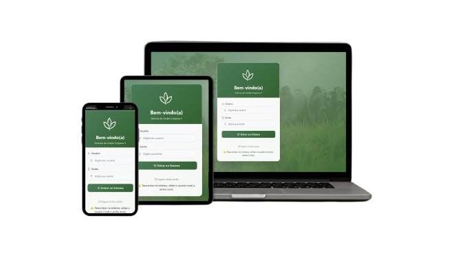 | 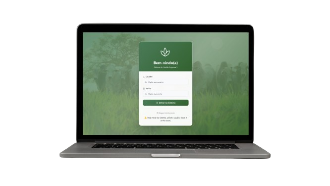 | 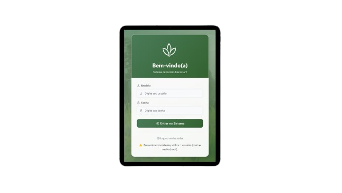 | 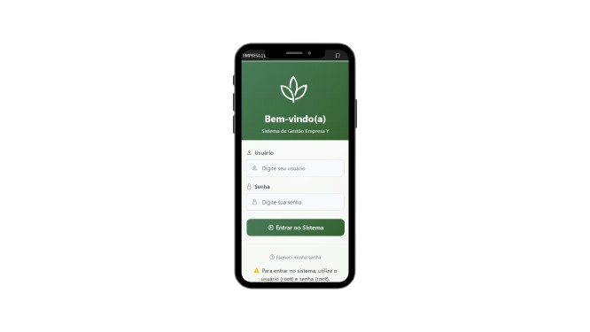 |
> 
> ### 📊 **Dashboard Principal**
> | Geral | Desktop | Tablet | Mobile |
> |:-------:|:------:|:------:|:------:|
> | 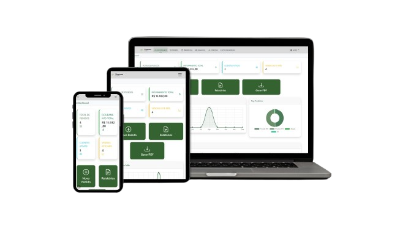 | 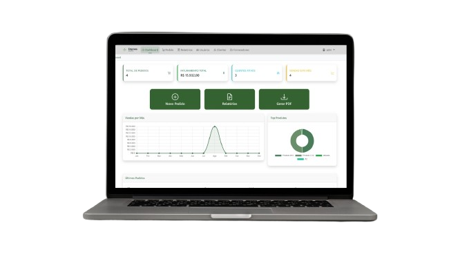 | 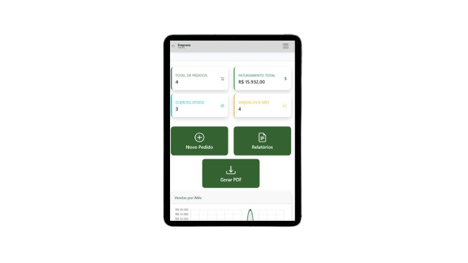 | 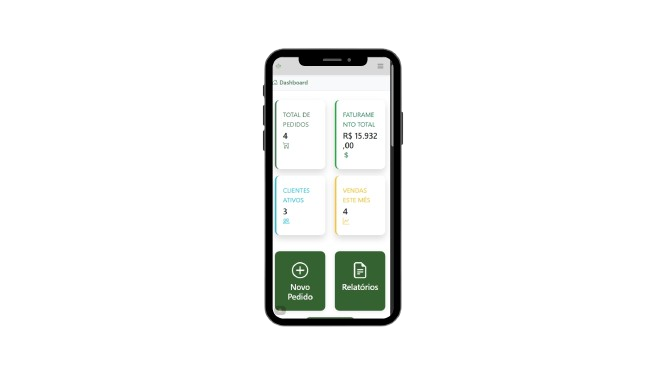 |
> 
> ### 👥 **Gestão de Clientes**
> | Geral | Desktop | Tablet | Mobile |
> |:-------:|:------:|:------:|:------:|
> | 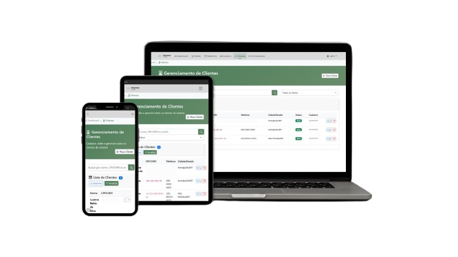 | 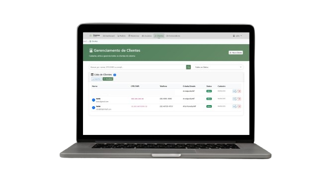 | 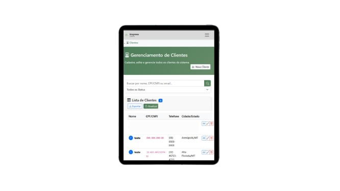 | 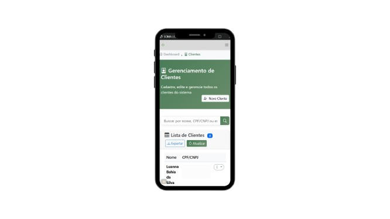 |
> 
> ### 📋 **Gestão de Pedidos**
> | Geral | Desktop | Tablet | Mobile |
> |:-------:|:------:|:------:|:------:|
> | 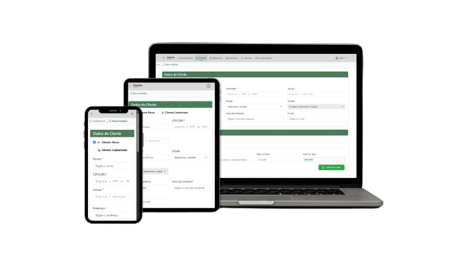 | 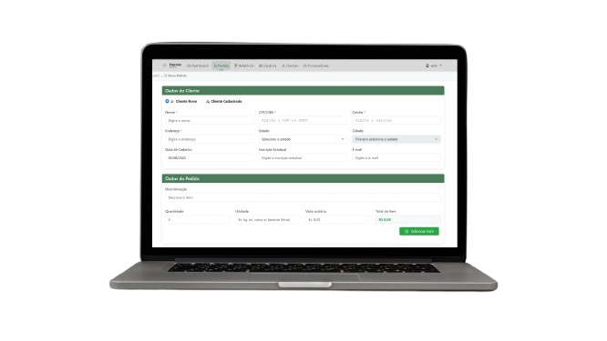 | 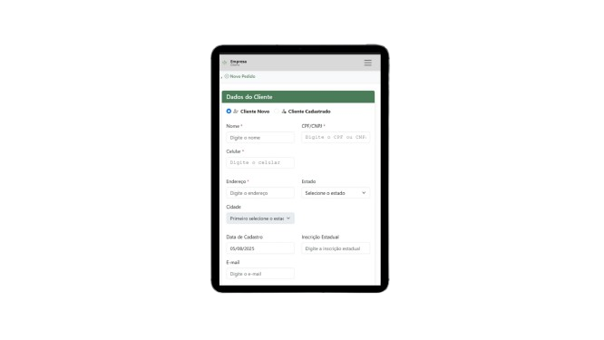 | 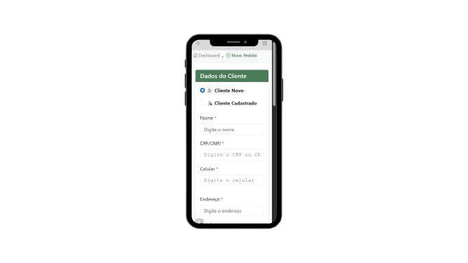 |
> 
> ### 🏭 **Gestão de Fornecedores**
> | Geral | Desktop | Tablet | Mobile |
> |:-------:|:------:|:------:|:------:|
> | 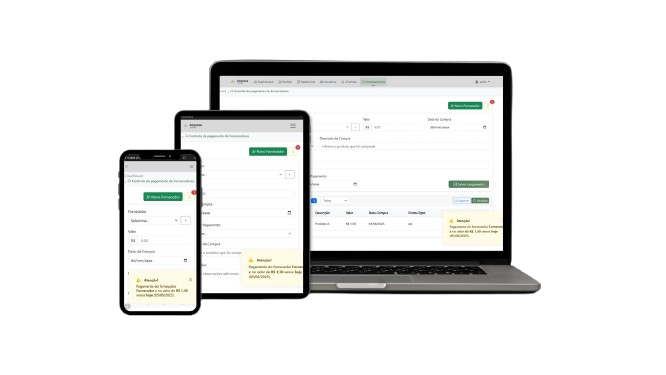 | 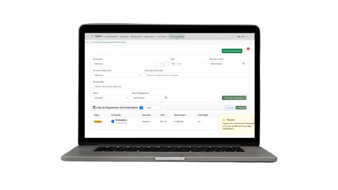 | 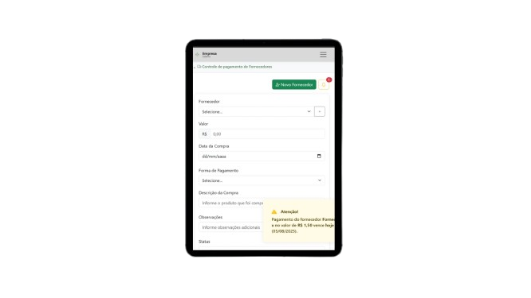 | 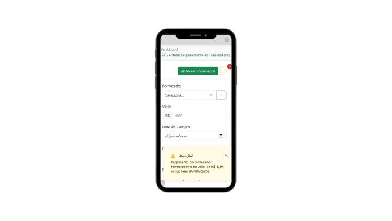 |
> 
> ### 👤 **Gestão de Usuários**
> | Geral | Desktop | Tablet | Mobile |
> |:-------:|:------:|:------:|:------:|
> | 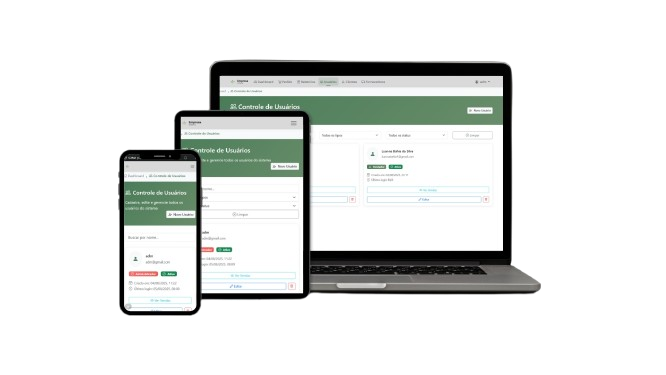 | 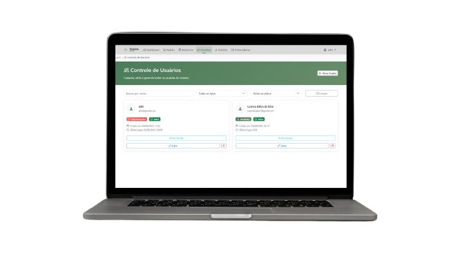 | 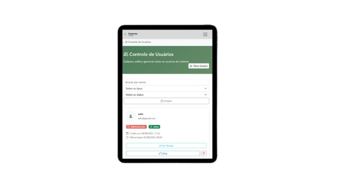 | 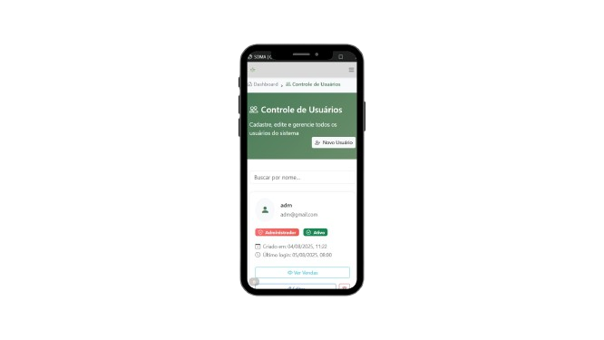 |
> 
> ### 📊 **Relatórios e Analytics**
> | Geral | Desktop | Tablet | Mobile |
> |:-------:|:------:|:------:|:------:|
> | 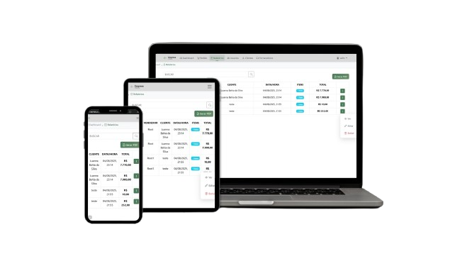 | 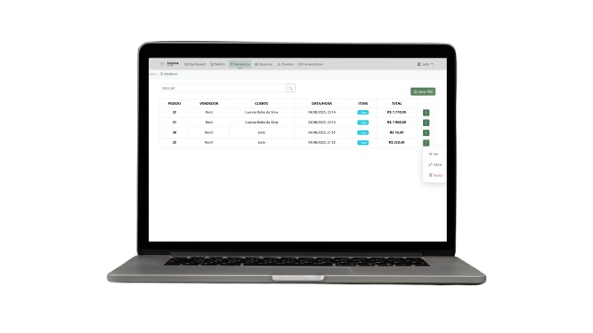 | 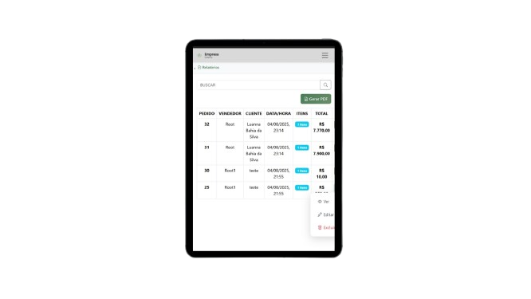 | 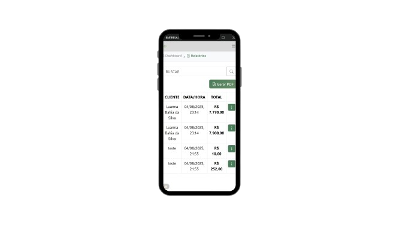 |
> 
> </div>
> 
> > 💡 **Visualização Comparativa**: Cada linha mostra como a mesma página se adapta perfeitamente a diferentes tamanhos de tela, mantendo funcionalidade e usabilidade em todos os dispositivos.

## 🛠️ Tecnologias Utilizadas

### **Frontend**
- 🎨 **HTML5/CSS3** - Estrutura e estilização
- ⚡ **JavaScript ES6+** - Lógica de aplicação
- 🎯 **Bootstrap 5.3.2** - Framework responsivo
- 🍭 **SweetAlert2** - Alertas e modais elegantes
- 🎪 **Bootstrap Icons** - Iconografia

### **Backend/Database**
- 🐘 **Supabase** - Backend as a Service
- 🗄️ **PostgreSQL** - Banco de dados relacional
- 🔐 **Row Level Security** - Segurança de dados
- 🚀 **Edge Functions** - Serverless computing

### **Ferramentas de Desenvolvimento**
- 📝 **VS Code** - Editor de código
- 🔧 **Git** - Controle de versão
- 🌐 **GitHub** - Repositório e colaboração
- 🧪 **Browser DevTools** - Debug e testes

## ⚙️ Instalação e Configuração

### **Pré-requisitos**
- Navegador web moderno
- Conta no Supabase (gratuita)
- Editor de código (recomendado: VS Code)

### **1️⃣ Clone o Repositório**
```bash
git clone https://github.com/seu-usuario/sistema.git
cd sistema
```

### **2️⃣ Configuração do Banco de Dados**
1. Crie uma conta no [Supabase](https://supabase.com)
2. Crie um novo projeto:
   - **Name**: Sistema empresa y
   - **Database Password**: Crie uma senha forte
   - **Region**: South America (São Paulo)
3. Execute o script `database/schema.sql` no SQL Editor
4. Configure as credenciais em `js/environment-config.js`

### **3️⃣ Configuração das Credenciais**
```javascript
// js/environment-config.js
const SUPABASE_URL = 'https://seu-projeto.supabase.co';
const SUPABASE_ANON_KEY = 'sua-chave-publica-aqui';
```

### **4️⃣ Executar o Sistema**
Abra o arquivo `index.html` em um servidor local ou hospede em uma plataforma como:
- ✅ **Vercel** (Recomendado)
- ✅ **Netlify** 
- ✅ **GitHub Pages**

## 📊 Estrutura do Projeto

```
sistema_empresa/
├── 📁 css/
│   ├── navbar.css
│   └── fornecedores-status.css
├── 📁 js/
│   ├── auth-manager.js
│   ├── backup.js
│   ├── clientes.js
│   ├── component-loader.js
│   ├── controle-acesso.js
│   ├── dashboard.js
│   ├── database.js
│   ├── devtools-protection.js
│   ├── environment-config.js
│   ├── fornecedores.js
│   ├── funcoes.js
│   ├── login.js
│   ├── pedido.js
│   ├── relatorio.js
│   ├── security.js
│   └── usuarios.js
├── 📁 node_modules/
├── 📁 pages/
│   ├── clientes.html
│   ├── dashboard.html
│   ├── forncedores.html
│   ├── pedido.html
│   ├── relatorio.html
│   └── usuarios.html
├── 📁 components/
│   └── navbar.html
├── 📁 database/
│   └── schema.sql
├── 📁 img/
│   ├── fundologin.jpg
│   ├── logo.png
│   └── responsividade/
├── index.html
├── LICENSE
├── package-lock.json
├── package.json
└── README.md
```

## 🎯 Estrutura do Banco de Dados

### **Tabela `usuarios`**
```sql
- id (UUID, chave primária)
- nome (VARCHAR)
- usuario (VARCHAR, único)
- senha (VARCHAR)
- email (VARCHAR)
- prioridade (ENUM: 'ADM', 'VENDEDOR')
- data_cadastro (TIMESTAMP)
```

### **Tabela `clientes`**
```sql
- id (UUID, chave primária)
- nome (VARCHAR)
- cpf_cnpj (VARCHAR, único)
- celular (VARCHAR)
- endereco (TEXT)
- cidade (VARCHAR)
- estado (VARCHAR)
- inscricao_estadual (VARCHAR)
- email (VARCHAR)
- data_cadastro (TIMESTAMP)
```

### **Tabela `pedidos`**
```sql
- id (UUID, chave primária)
- cliente_id (UUID, chave estrangeira)
- vendedor (VARCHAR)
- discriminacao (TEXT)
- quantidade (DECIMAL)
- unidade (VARCHAR)
- valor_unitario (DECIMAL)
- total (DECIMAL)
- data_pedido (DATE)
- created_at (TIMESTAMP)
```

### **Tabela `fornecedores`**
```sql
- id (UUID, chave primária)
- nome (VARCHAR)
- cpf_cnpj (VARCHAR)
- celular (VARCHAR)
- endereco (TEXT)
- created_at (TIMESTAMP)
```

### **Tabela `fornecedores_pagamentos`**
```sql
- id (UUID, chave primária)
- fornecedor_id (UUID, chave estrangeira)
- descricao_compra (TEXT)
- valor (DECIMAL)
- data_compra (DATE)
- data_pagamento (DATE)
- status_pagamento (ENUM: 'pendente', 'pago')
- forma_pagamento (VARCHAR)
- observacoes (TEXT)
- created_at (TIMESTAMP)
```

## 🔐 Segurança e Licença

### **Segurança Implementada**
- 🔒 Autenticação de usuários com sessões seguras
- 🛡️ Validação rigorosa de entrada de dados
- 🔐 Proteção contra SQL Injection via Supabase
- 🚫 Sanitização de inputs no frontend
- 📱 Proteção contra DevTools em produção
- 🔑 Controle de acesso baseado em níveis de usuário

### **Licença e Uso**
Este projeto foi desenvolvido como trabalho freelancer para uso exclusivo da empresa contratante.

**⚠️ TERMOS DE USO:**
- ❌ **Não é permitido** uso comercial por terceiros
- ❌ **Não é permitido** redistribuição do código fonte
- ❌ **Não é permitido** modificação para outros clientes
- ✅ **Permitido** estudo do código para fins educacionais
- ✅ **Permitido** fork para portfolio pessoal (sem dados sensíveis)

```
Copyright (c) 2025 - Projeto Freelancer
Todos os direitos reservados à empresa contratante.
```

## 👨‍💻 Sobre o Desenvolvimento

Este sistema foi desenvolvido como projeto freelancer, focando em:

### **Metodologia de Desenvolvimento**
- 📋 **Levantamento de requisitos** detalhado com o cliente
- 🎨 **Prototipagem** da interface antes da implementação  
- 🔄 **Desenvolvimento iterativo** com feedback contínuo
- 🧪 **Testes extensivos** em múltiplos dispositivos
- 📚 **Documentação completa** para manutenção futura

### **Desafios Técnicos Superados**
- Responsividade complexa para múltiplos dispositivos
- Integração com APIs externas (CEP, validações)
- Sistema de notificações em tempo real
- Cálculos automáticos com precisão financeira
- Gestão de estado complexo no frontend
- Otimização de performance para grandes volumes de dados

### **Diferenciais Implementados**
- 🎯 **Interface intuitiva** para usuários não técnicos
- ⚡ **Performance otimizada** para uso diário intenso
- 🔧 **Código maintível** com comentários e estrutura clara
- 📈 **Escalabilidade** preparada para crescimento futuro
- 🛡️ **Segurança robusta** seguindo melhores práticas

## 📈 Métricas do Projeto

### **Tempo de Desenvolvimento**
- ⏱️ **Duração total**: 8 semanas
- 📅 **Fases**:
  - Análise e planejamento: 1 semana
  - Desenvolvimento frontend: 4 semanas  
  - Backend e integração: 2 semanas
  - Testes e ajustes: 1 semana

### **Estatísticas do Código**
- 📄 **Linhas de código**: ~15.000
- 📂 **Arquivos**: 25+
- 🎨 **Componentes**: 12
- 🔧 **Funções**: 80+

## 🚀 Roadmap e Atualizações Futuras

### **📅 Próximas Atualizações Planejadas**

O sistema está em constante evolução! Futuras versões incluirão modernizações tecnológicas significativas:

### **⚛️ Migração para React.js**
- 🔄 **Refatoração completa** do frontend para React
- 📦 **Componentização avançada** com hooks e context
- ⚡ **Performance otimizada** com Virtual DOM
- 🎯 **TypeScript** para maior robustez e produtividade
- 🧪 **Testes automatizados** com Jest e React Testing Library

### **🛠️ Stack Tecnológico Futuro**
**Frontend Moderno:**
- ⚛️ **React 18+** - Framework principal
- 📘 **TypeScript** - Tipagem estática
- 🎨 **Styled Components** ou **Tailwind CSS** - Estilização moderna
- 📊 **React Query** - Gerenciamento de estado servidor
- 🔥 **Vite** - Build tool ultrarrápido

**Backend Evoluído:**
- 🟢 **Node.js + Express** - API REST robusta
- 🗃️ **Prisma ORM** - Modelagem de dados moderna
- 🔐 **JWT + Refresh Tokens** - Autenticação avançada
- 📝 **Swagger/OpenAPI** - Documentação automática
- 🧪 **Testes de integração** com Supertest

### **📱 Funcionalidades Futuras**
- 📊 **Dashboard em tempo real** com WebSockets
- 📱 **PWA** (Progressive Web App) para instalação mobile
- 🔔 **Notificações push** para atualizações importantes
- 📈 **Analytics avançado** com gráficos interativos
- 🌐 **API pública** para integrações externas
- 🤖 **Automações inteligentes** com IA

### **🎯 Cronograma de Migração**
- **Q2 2025**: Início da refatoração para React
- **Q3 2025**: Implementação do backend Node.js
- **Q4 2025**: Lançamento da versão 2.0
- **Q1 2026**: Funcionalidades avançadas e PWA

> 💡 **Por que React?** A migração para React proporcionará melhor manutenibilidade, performance superior, ecossistema mais robusto e facilidade para implementar funcionalidades complexas como real-time updates e interfaces mais dinâmicas.

## 🚀 Hospedagem e Deploy

### **Recomendações de Hospedagem**

**Frontend (Gratuito):**
- 🌟 **Vercel** - Deploy automático via Git
- 🌐 **Netlify** - CI/CD integrado
- 📄 **GitHub Pages** - Hospedagem simples

**Backend:**
- 🐘 **Supabase** - 500MB gratuitos + PostgreSQL
- 🔥 **Firebase** - Alternativa NoSQL
- ⚡ **Railway** - PostgreSQL managed

### **Processo de Deploy**
1. Conectar repositório à plataforma
2. Configurar variáveis de ambiente
3. Deploy automático a cada push
4. Monitoramento de performance

## 📞 Contato e Suporte

Para dúvidas sobre implementação ou interesse em projetos similares:

- 💼 **LinkedIn**: https://www.linkedin.com/in/luannabahia/
- 📧 **Email**: luanna.dev@gmail.com
- 🌐 **Portfolio**: https://portfolio-luanna.vercel.app/
- 💬 **Instagram Dev**: https://www.instagram.com/dev.luanna/
- 💬 **Instagram Pessoal**: https://www.instagram.com/luannabahia_

## 🤝 Como Colaborar com o Projeto

### **📍 Repositório GitHub**
O projeto está disponível no GitHub para fins educacionais e colaboração:

🔗 **Link do repositório**: `https://github.com/luannabahia/sistema-empresa`

### **🎯 Formas de Contribuir**

#### **🐛 Reportar Bugs**
- Abra uma **Issue** descrevendo o problema encontrado
- Inclua prints e informações do ambiente (navegador, OS)
- Detalhe os passos para reproduzir o bug

#### **💡 Sugerir Melhorias**
- Use as **Issues** para propor novas funcionalidades
- Compartilhe ideias de otimização de performance
- Sugira melhorias na experiência do usuário

#### **🔧 Contribuir com Código**
- Faça um **Fork** do repositório
- Crie uma **branch** para sua feature: `git checkout -b feature/nova-funcionalidade`
- Commit suas mudanças: `git commit -m 'Add: nova funcionalidade'`
- Push para a branch: `git push origin feature/nova-funcionalidade`
- Abra um **Pull Request** com descrição detalhada

#### **📚 Melhorar Documentação**
- Contribua com a documentação do código
- Traduza README para outros idiomas
- Adicione exemplos de uso e tutoriais

### **🏷️ Convenções do Projeto**

#### **📝 Commits Semânticos**
```
feat: nova funcionalidade
fix: correção de bug
docs: alteração na documentação
style: formatação, ponto e vírgula faltando, etc
refactor: refatoração de código
test: adicionando testes
chore: alteração de build, etc
```

#### **🌿 Branches**
- `main` - Produção estável
- `develop` - Desenvolvimento ativo
- `feature/nome-da-feature` - Novas funcionalidades
- `hotfix/nome-do-fix` - Correções urgentes

### **⚠️ Importante**
- Este é um projeto **freelancer** com direitos reservados ao cliente
- Contribuições são para **fins educacionais**
- Não use dados reais nos exemplos ou testes
- Respeite as **boas práticas** de desenvolvimento

### **🎁 Reconhecimento**
Todos os colaboradores serão creditados no arquivo `CONTRIBUTORS.md` e receberão menção especial nas releases!

### **Serviços Oferecidos**
- 🏗️ Desenvolvimento de sistemas web personalizados
- 📱 Aplicações responsivas e mobile-first
- 🔧 Integração com APIs e bancos de dados
- 🎨 UI/UX design para aplicações empresariais
- 🛠️ Manutenção e suporte técnico

---

<div align="center">

**💼 Desenvolvido com dedicação para atender às necessidades empresariais reais**

[](#)
[](#)
[](#)
[](#)

**🏆 Projeto desenvolvido como freelancer - Resultados reais para negócios reais**

</div>
